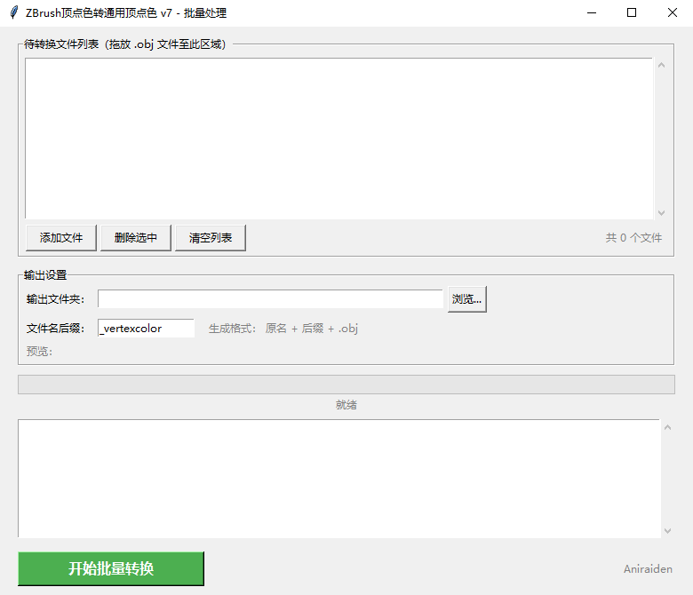

# ZBrush MRGB → 顶点色转换器



[English Version](#zbrush-mrgb--vertex-color-converter)

将 ZBrush OBJ 中 MRGB 顶点色数据转换为通用 RGB 浮点顶点色的 GUI 工具，支持 KeyShot、Blender 等 DCC 软件。

## 功能

- 批量拖放 OBJ 文件，自定义输出文件夹和文件名后缀
- 自动去除 `mtllib` / `usemtl` 引用
- `mmap` 流式处理大文件，低内存占用
- 颜色数与顶点数不匹配警告
- 进度条显示转换进度

## 使用方法

```bash
pip install tkinterdnd2    # 可选，启用拖放功能
python convert_mrgb_v7.py
```

也可直接使用 [Releases](https://github.com/aniraiden/ZBrush-MRGB-Converter/releases) 中的 EXE。

打包：

```bash
pip install pyinstaller
pyinstaller MRGB_Converter_v7.spec
```

## 转换原理

ZBrush OBJ 中顶点色以 `#MRGB` 区块存储（如 `FF7F3F80`）。工具解析后转为 `v x y z r g b` 格式，使 KeyShot、Blender 等正确识别顶点色。

## 版本

| 文件 | 说明 |
|------|------|
| `convert_mrgb_v5.py` | 单文件版，mmap 流式处理 |
| `convert_mrgb_v6.py` | 批量处理初版 |
| **`convert_mrgb_v7.py`** | **最新版** — 批量拖放、线程安全修复、颜色不匹配警告 |
| `MRGB_Converter_v7.spec` | PyInstaller 打包配置（基于 v7） |

## 许可证

MIT License

## 作者

Aniraiden

---

# ZBrush MRGB → Vertex Color Converter

A GUI tool to convert MRGB vertex colors from ZBrush OBJ files to standard RGB float format, compatible with KeyShot, Blender, and other DCC apps.

## Features

- Batch drag-and-drop OBJ files, custom output folder & filename suffix
- Auto-strips `mtllib` / `usemtl` references
- `mmap` streaming for large files, low memory footprint
- Mismatch warning when color count ≠ vertex count
- Progress bar

## Usage

```bash
pip install tkinterdnd2    # optional, for drag-and-drop
python convert_mrgb_v7.py
```

Or use the pre-built EXE from [Releases](https://github.com/aniraiden/ZBrush-MRGB-Converter/releases).

Build:

```bash
pip install pyinstaller
pyinstaller MRGB_Converter_v7.spec
```

## How It Works

ZBrush OBJ stores vertex colors in `#MRGB` blocks (e.g. `FF7F3F80`). This tool parses them and converts to `v x y z r g b` format, enabling correct vertex color display in KeyShot, Blender, etc.

## Versions

| File | Description |
|------|-------------|
| `convert_mrgb_v5.py` | Single-file, mmap streaming |
| `convert_mrgb_v6.py` | Initial batch version |
| **`convert_mrgb_v7.py`** | **Latest** — batch drag-drop, thread-safe, color mismatch warning |
| `MRGB_Converter_v7.spec` | PyInstaller build config (based on v7) |

## License

MIT License

## Author

Aniraiden
